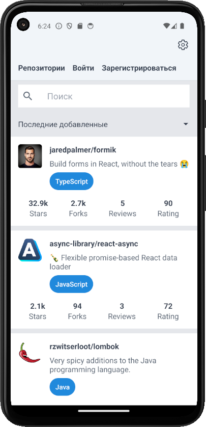

#rate-repository-app

Небольшое приложение на  React Native для рейтинга репозиториев на GitHub.
Приложение разработано на платформе Expo. В качестве серверной части приложения используется  https://github.com/fullstack-hy2020/rate-repository-api, предоставляющее Apollo GraphQL API для взаимодействия с сервером.   

Приложение обладает следующим функционалом: 
## Сортировка и фильтр репозиториев
- sorting and filtering reviewed repositories, 
- сортировка и фильтр репозиториев
- registering a user, 
- logging in and 
- creating a review for a repository. 
  
Two settings are available to the user:
- user interface language (English, Russian)
- appearance (light or dark theme)

The application is developed with Expo and uses GraphQL for interactions with server.

The application is a part of Full Stack open (https://fullstackopen.com/en/). The back end for the application is provided by https://github.com/fullstack-hy2020/rate-repository-api

