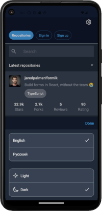

#rate-repository-app

Небольшое приложение на  React Native для рейтинга репозиториев GitHub.
Приложение разработано с использованием инструментов Expo. В качестве серверной части приложения используется  https://github.com/fullstack-hy2020/rate-repository-api, предоставляющее Apollo GraphQL API для взаимодействия с сервером.   

Приложение имеет следующий функционал:
- сортировка и фильтр репозиториев,
- просмотр отдельного репозитория и отзывов о нём,
- регистрация нового пользователя,
- авторизация зарегистрированного пользователя,
- создание отзыва о репозитории.
  
Пользователь имеет возможность выбрать следующие настройки:
- язык интерфейса приложения (русский, английский),
- тема оформления.
  
Настройки, выбранные пользователем сохраняются в памяти устройства.

### Функционал, доступный неавторизованным пользователям

          

### Дополнительный функционал, доступный авторизованным пользователям
  