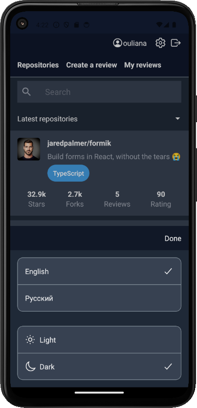

# rate-repository-app

A simple React Native application for rating GitHub repositories. 
The application is developed with Expo and uses Apollo GraphQL API for interactions with server.
The backend is provided by https://github.com/fullstack-hy2020/rate-repository-api.  

The application has features such as, 
- sorting and filtering reviewed repositories, 
- viewing a single repository and reviews,
- registering a user, 
- logging in and 
- creating a review for a repository. 
  
The following settings are available to the user:
- user interface language (English, Russian)
- appearance (light or dark theme)

 
Настройки, выбранные пользователем сохраняются в памяти устройства.

### Features available to unauthorized users

          

 ### Additional features available to authorized users
  

